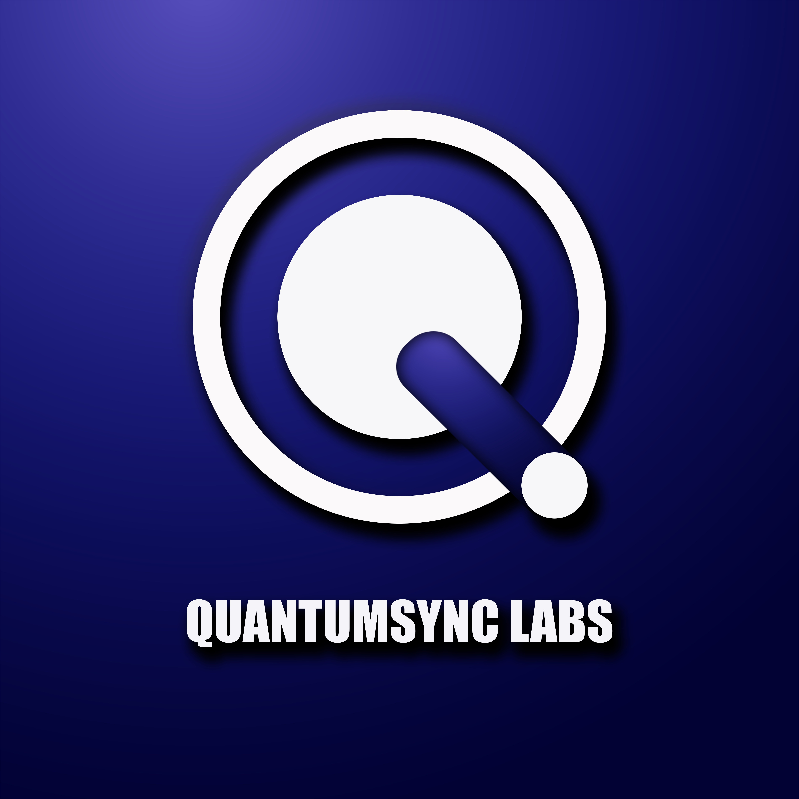

# QuantumSync Labs Website



**Empowering digital transformation through innovative, secure, and scalable IT solutions.**

---

## Table of Contents

* [About](#about)
* [Features](#features)
* [Tech Stack](#tech-stack)
* [Getting Started](#getting-started)
* [Project Structure](#project-structure)
* [Deployment](#deployment)
* [Contributing](#contributing)
* [License](#license)
* [Contact](#contact)

---

## About

**QuantumSync Labs** is a leading-edge IT solutions provider, offering cloud, AI, and software engineering services. This repository contains our official website, built with the latest frontend technologies for performance, accessibility, and a seamless user experience.

Explore our services, read insightful blog posts, meet the team, and get in touch!

---

## Features

* ⚡ **Modern Responsive UI** – Optimized for all devices and screen sizes.
* 🚀 **Fast & Lightweight** – Powered by [Vite](https://vitejs.dev/) and code-splitting.
* 🎨 **Beautiful Animations** – Smooth transitions using [Framer Motion](https://www.framer.com/motion/).
* 🌙 **Dark Mode** – Comfortable viewing any time of day.
* 📚 **Dynamic Blog** – Easily add and showcase articles.
* 🧩 **Modular Components** – Reusable and maintainable code.
* 🌍 **SEO Optimized** – Meta tags and open graph for sharing.
* 🛡️ **Security Best Practices** – Contact forms use EmailJS, no sensitive data stored.

---

## Tech Stack

* [React](https://react.dev/) (with functional components & hooks)
* [Vite](https://vitejs.dev/) (blazing-fast build tool)
* [Tailwind CSS](https://tailwindcss.com/) (utility-first styling)
* [Framer Motion](https://www.framer.com/motion/) (animations)
* [React Router](https://reactrouter.com/) (routing)
* [EmailJS](https://www.emailjs.com/) (contact form backendless)
* [React Icons](https://react-icons.github.io/react-icons/) (iconography)
* [ESLint](https://eslint.org/) & [Prettier](https://prettier.io/) (code quality)
* [Netlify/Vercel/GitHub Pages](https://vercel.com/) (deployment-ready)

---

## Getting Started

### 1. Clone the repo

```bash
git clone https://github.com/QuantumSync-Labs-PLC/qslabs-web.git
cd qslabs-web
```

### 2. Install dependencies

```bash
npm install
```

### 3. Start the development server

```bash
npm run dev
```

Visit [http://localhost:3000](http://localhost:3000) to view the app.

---

## Project Structure

```
src/
│
├── assets/           # Images, icons, logo, etc.
├── components/       # Reusable UI components
├── data/             # Data files (services, team, blogs, reviews, etc.)
├── pages/            # Page-level React components (Home, About, Services, etc.)
├── sections/         # Section components (Hero, BlogList, ServicesSection, etc.)
├── theme/            # Tailwind config, custom styles
├── App.jsx           # Root component
├── main.jsx          # App entry point
└── ...               # More files as needed
```

---

## Deployment

You can deploy this project on any static hosting provider:

* **Vercel**
  [](https://vercel.com/import/project)

* **Netlify**
  [](https://netlify.com/)

* **GitHub Pages**
  Use `npm run build` and push the `dist/` folder.

### To build for production:

```bash
npm run build
```

---

## Contributing

Pull requests are welcome! For major changes, please [open an issue](https://github.com/QuantumSync-Labs-PLC/qslabs-web/issues) first to discuss what you would like to change.

**How to contribute:**

1. Fork the repo
2. Create your feature branch (`git checkout -b feature/my-feature`)
3. Commit your changes (`git commit -am 'Add some feature'`)
4. Push to the branch (`git push origin feature/my-feature`)
5. Open a Pull Request

---

## License

This project is licensed under the [MIT License](LICENSE).

---

## Contact

Questions? Suggestions?
Email us at: **[labsquantumsync@gmail.com](mailto:labsquantumsync@gmail.com)**
Or reach out via [LinkedIn](https://www.linkedin.com/company/quantumsync-labs)

---

> **QuantumSync Labs** – Accelerating your digital future.
